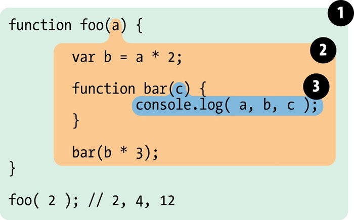

## 关于javascript作用域详解

>  javascript作用域在我们实际工作中息息相关，同时在我们面试求职过程也不可避免成为了八股文级别的面试题，例如 （var let const 区别），虽说很无聊，我们这期就作用域先写个几百字来说说

### 1、关于作用域的工作模型
---

+ **词法作用域**：词法作用域是由你在写代码时将变量和块作用域写在哪里来决定的，因此当词法分析器处理代码时会保持作用域不变（部分情况会有变化）；（javascript所采用的是词法作用域）

+ **动态作用域**：动态作用域则不关心函数和作用域是如何声明以及在何处声明的，只关心在哪里调用

### 2、词法作用域与欺骗词法
---
为了方便我们理解词法作用域，我们简单的将作用域想象成为一个气泡，如下图所示:



我们可以通过上面的气泡图结构直接香菇的书写位置信息看出作用域的范围，同样引擎可以通过位置关系去查找标识符的位置，作用域查找是逐级向外或者说向上进行，直到遇见第一个匹配的标识符为止

#### （1）关于eval(...) 欺骗词法作用域

首先我们看下面一段例子
```javascript
function foo(str, a) {
    eval( str ); // 欺骗
    console.log( a, b 
);}
var b = 2;
foo( "var b = 3;", 1 ); // 1, 3
```
eval()会在作用域内新生成一个`a = 3`的局部变量，按照词法作用域逐级寻找的办法，输出内容就是1,3
当然在严格模式下，eval()有自己的词法作用域，不会对其他的作用域产生负面影响，我们试着运行一下下面的例子
```javascript
function foo(str, b) {
    "use strict"
    eval(str) // 1 2
    console.log(a) // ReferenceError: a is not defined
}
foo('var a = 1; console.log(a, b)', 2)
```
在严格模式下，我们可以吧eval()作为一个独立的“气泡”来去看待，eval()内部找不到的变量也会遵循逐级向上查找；

#### (2)关于with
我们先用下面一个例子来看with的基本用法
```javascript
// obj.a = 1
// obj.b = 2
// 等价于
// width(obj) {
//     a = 1,
//     b = 3
// }


function foo(obj) {
    with (obj) {
        a = 2;
    }
}
var o1 = {a: 3}

foo(o1)
console.log(o1.a, a) // 2, 2
```
在实际中with通常用作改善对象赋值操作，但是with会把变量值a转为全局作用域；

最后我们需要注意的是，在实际开发过程中不推荐使用eval()和with()，一方面是性能原因，另一方面在严格模式下with被完全禁止使用。

### 3、块级作用域
---

首先，我们通过下面一个老生常谈的例子来看
```javascript
function foo() {
    for(var i = 0; i < 10; i++) {
        console.log(i)
    }
    console.log(i, '外层i')
}
foo()
// 1
// ...
// 10 外层i
```
我们发现在用for循环的时候，意外让i泄露到foo()函数内，事实上，我们只希望i的作用域在函数for循环内部使用，而不是在for外部使用他，所以如果局部代码有一个块的概念去限制变量的生效范围，那代码的可维护性就有很大的帮助，然而在es5之前javascript是没有块级作用域的概念（当然有些情况下是会创建块级作用域），直到es6中有了块级作用域，具体有一下几种方式：
#### （1）try/catch
其中catch语句会创建一个仅在catch内生效的块级作用域
```javascript
try{
    foo()
} catch(err) {
    console.log(err) // foo is not defined
}
console.log(err) // err is not defined
```
#### (2) let / const

那我们之前举例的for循环来讲
```javascript
for(let i = 0; i < 10; i++) {
    console.log(i)
}
console.log(i) // i is not defined
```
#### (3) {} + let / const
如果我们想在一段代码内加入块级作用域防止污染，就可以通过{}方式圈定范围，如下所示
```es6
function foo() {
    {
        const b = 'hello world'
        var c = 'test'
        console.log(b, c)
    }
    console.log(c)
    console.log(b)
}
foo() 
// hello world test
// test
// b is not defined
```
同样我们也需要注意，在{}内我们需要通过let与const关键字来去声明以后，会自动劫持就近的{}块作为变量的使用范围。

### 4、变量提升

关于变量提升是一个老生常谈的问题，我们先看一个无趣的例子
```javascript
console.log(a) // undefined
var a = 2
```
理解这段代码，之前面试很多人解释大差不差都是这样的：`"js在运行的时候，通过var声明的变量会被提升到顶部作用域顶部，而它的赋值会被放在原位置，所以我们一开始是可以使用变量，但不能获取到其值”`；

这句话看似正确，然而这是一种不严谨的回答，那么我们应该如何正确的去理解呢？

* 首先，我们去理解一下编译器引擎如何执行js的一个过程，如下图所示（当然这也是一个主体流程）；

* 编译器的编译阶段的一部分工作便是找到所有的声明（`var a`），并用合适的作用域把他们关联起来；
* 在运行阶段，会将值赋值给变量（`a = 2`)

因此总结一下，如下图所示
```mermaid
graph LR
1[编译器收集(var a)] --> 2[运行console.log(a)] --> 2[编译阶段生成的作用域中找到是否有a变量] --> 3[拿到一个undefined值的内容]->3[进行a = 2赋值]
```

### 5、函数优先
---

在说这个之前，我们就不得不说函数声明的两种方式“命名式” 和 “函数表达式”，具体如下面两个例子
```javascript
foo() // 1
// 命名式
function foo() {
    console.log(1)
}

bar() // TypeError xxxx
// 函数表达式
var bar = function () {
    console.log(123)
}
```
这两个都会被变量提升，但是命名式会连带函数的隐含值一起被提升，表达式方式就和我们常规var声明变量的方式一样，声明提前，赋值随后；

了解上面，那么我们就开始说一下函数优先优势一个怎么回事儿，常规套路我们先看例子
```javascript
foo() // 1
var foo;
function foo() {
    console.log( 1 );
}

foo = function () {
    console.log(2)
}
```
首先我们通过function进行了函数foo声明，不管前面的var foo，还是后面对于foo 进行赋值，始终会以`function foo() `优于`var foo = `的方式进行；

那么我们在看一下下面
```javascript
foo() // 3
function foo() {
    console.log( 1 );
}
var foo = function () {
    console.log(2)
}
function foo() {
    console.log( 3 );
}
```
`function foo()`会以最后一个为结果，但是也会优先于`var foo`的方式，可以说是函数时一等公民实锤了

### 6、写在最后
---

这里我们讲了函数作用域的一些内容，希望你能有一丝收获~